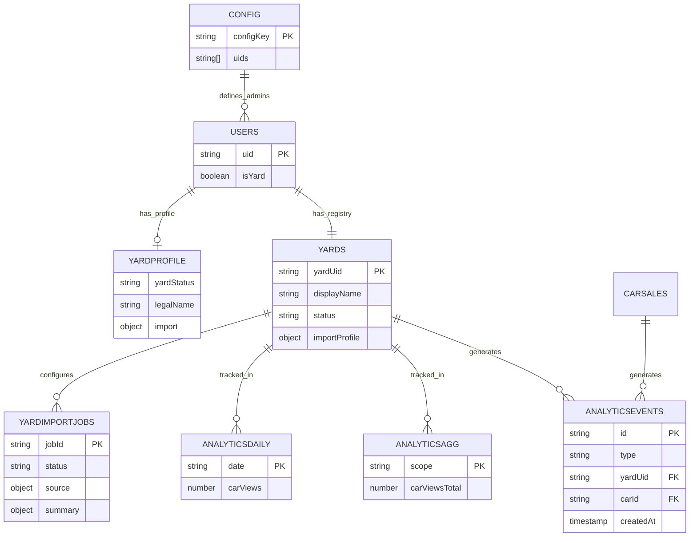

# CarExpert Web - Firestore Data Model & Relationships

> **Last Updated:** 2025-12-09  
> **Scope:** Web application (React + TypeScript) using Firebase/Firestore  
> **Note:** This document focuses on Firestore collections. For Android Room database schema, see `DATA_SCHEMA.md`.

---

## Overview

The CarExpert web application uses **Firebase Firestore** as its primary database. The data model is organized around core business entities:

- **Cars**: Public car listings (`publicCars`) and private yard inventory (`users/{uid}/carSales`)
- **Users**: User profiles, roles, and subscription plans (`users`)
- **Yards**: Yard profiles stored within user documents (`users/{uid}` with `isYard: true`) and admin registry (`yards`)
- **Promotions**: Promotion products and orders (`promotionProducts`, `promotionOrders`)
- **Leads**: Customer inquiries for cars (`leads`, `users/{uid}/leads`)
- **Billing**: Billing plans and snapshots (`billingPlans`, `billingPeriods/{periodId}/entities`)
- **Admin**: Yard registry (`yards`), system configuration (`config`), and analytics (`analyticsEvents`, `analyticsAgg`, `analyticsDaily`)

### High-Level Relationship Summary

- **Yards** (users with `isYard: true`) own **Cars** (stored in `users/{uid}/carSales`)
- **Cars** can be published to **Public Listings** (`publicCars` collection)
- **Private Sellers** create **Car Ads** (`carAds` collection)
- **Buyers** create **Leads** when interested in cars
- **Users** can purchase **Promotions** to boost visibility
- **Billing** tracks lead consumption and charges per subscription plan
- **Admin** manages yard status and import configuration via `yards` collection
- **Analytics** tracks car views and aggregates statistics for dashboards

---

## Collections Reference

### Root Collections

#### Collection: `publicCars`

**Path:** `publicCars/{publicCarId}`

**Purpose:** Public representation of cars visible to buyers and external channels (search results, Facebook shares, etc.). This is the canonical source for public-facing car data.

**Document ID:** Firestore-generated ID (used as `publicCarId` in other collections)

| Field | Type | Required | Description |
|-------|------|----------|-------------|
| `id` (doc ID) | string | yes | Firestore document ID, used as `publicCarId` |
| `carSaleId` | string | no | Links to `users/{uid}/carSales/{carId}` (legacy field) |
| `originalCarId` | string | no | Alternative link to carSales (legacy field) |
| `carId` | string | no | Alternative link to carSales (legacy field) |
| `yardUid` | string | no | Owner yard's Firebase Auth UID (also: `ownerUid`, `userId`) |
| `isPublished` | boolean | no | Publication status (true = visible to public) |
| `brand` | string | no | Car brand (Hebrew) |
| `brandId` | string | no | Catalog brand ID |
| `model` | string | no | Car model (Hebrew) |
| `modelId` | string | no | Catalog model ID |
| `year` | number | no | Manufacturing year |
| `price` | number | no | Sale price (ILS) |
| `mileageKm` | number | no | Mileage in kilometers |
| `city` | string | no | City name |
| `cityId` | string | no | City catalog ID |
| `regionId` | string | no | Region catalog ID |
| `regionNameHe` | string | no | Region name (Hebrew) |
| `cityNameHe` | string | no | City name (Hebrew) |
| `neighborhoodId` | string | no | Neighborhood catalog ID |
| `neighborhoodNameHe` | string | no | Neighborhood name (Hebrew) |
| `mainImageUrl` | string | no | Canonical main image URL (Storage) |
| `imageUrls` | string[] | no | Array of image URLs (Storage) |
| `imagesCount` | number | no | Count of images (redundant, derived from `imageUrls.length`) |
| `gearboxType` | string | no | AUTOMATIC, MANUAL, ROBOTIC, CVT |
| `fuelType` | string | no | BENZIN, DIESEL, HYBRID, PLUG_IN, ELECTRIC |
| `bodyType` | string | no | SEDAN, HATCHBACK, SUV, etc. |
| `color` | string | no | Car color |
| `handCount` | number | no | Number of previous owners |
| `engineDisplacementCc` | number | no | Engine capacity in cc |
| `licensePlatePartial` | string | no | Last digits of license plate |
| `notes` | string | no | Additional notes/description |
| `createdAt` | Timestamp | no | Creation timestamp |
| `updatedAt` | Timestamp | no | Last update timestamp |

**Legacy Image Fields (deprecated, use `imageUrls`):**
- `imagesJson`: stringified JSON array of image objects
- `images`: array of image objects
- `ImagesCount`, `images_count`: alternative count field names

**Notes:**
- Multiple linking fields (`carSaleId`, `originalCarId`, `carId`) exist for backward compatibility
- Image normalization is handled by `normalizeCarImages()` helper (see `web/src/utils/carImageHelper.ts`)
- `isPublished: true` is the source of truth for public visibility

---

#### Collection: `carAds`

**Path:** `carAds/{adId}`

**Purpose:** Car advertisements posted by private sellers (non-yard users). Separate from yard cars to support different workflows and permissions.

**Document ID:** Firestore-generated ID

| Field | Type | Required | Description |
|-------|------|----------|-------------|
| `id` (doc ID) | string | yes | Firestore document ID |
| `ownerType` | string | no | PRIVATE_SELLER, YARD, AGENT |
| `ownerUserId` | string | yes | Firebase Auth UID of the seller |
| `status` | string | no | ACTIVE, PAUSED, SOLD |
| `manufacturer` | string | no | Brand name (Hebrew) |
| `manufacturerId` | string | no | Catalog brand ID |
| `model` | string | no | Model name (Hebrew) |
| `modelId` | string | no | Catalog model ID |
| `year` | number | no | Manufacturing year |
| `mileageKm` | number | no | Mileage in kilometers |
| `price` | number | no | Sale price (ILS) |
| `city` | string | no | City name |
| `cityId` | string | no | City catalog ID |
| `regionId` | string | no | Region catalog ID |
| `gearboxType` | string | no | Gearbox type |
| `fuelType` | string | no | Fuel type |
| `color` | string | no | Car color |
| `handCount` | number | no | Number of previous owners |
| `engineDisplacementCc` | number | no | Engine capacity |
| `description` | string | no | Free-text description |
| `phone` | string | no | Contact phone |
| `email` | string | no | Contact email |
| `imageUrls` | string[] | no | Array of image URLs (Storage) |
| `mainImageUrl` | string | no | Main image URL |
| `viewsCount` | number | no | Number of views (for stats) |
| `promotion` | object | no | `CarPromotionState` (boostUntil, highlightUntil, etc.) |
| `createdAt` | Timestamp | no | Creation timestamp |
| `updatedAt` | Timestamp | no | Last update timestamp |

---

#### Collection: `users`

**Path:** `users/{uid}`

**Purpose:** User profiles and authentication data. For yard users, this document also contains yard profile information.

**Document ID:** Firebase Auth UID

| Field | Type | Required | Description |
|-------|------|----------|-------------|
| `uid` (doc ID) | string | yes | Firebase Auth UID |
| `email` | string | no | User email |
| `fullName` | string | no | Full name |
| `phone` | string | no | Phone number |
| `role` | string | no | Legacy role field |
| `canBuy` | boolean | no | Capability flag |
| `canSell` | boolean | no | Capability flag |
| `isAgent` | boolean | no | Agent role flag |
| `isYard` | boolean | no | Yard role flag |
| `isAdmin` | boolean | no | Admin role flag |
| `status` | string | no | ACTIVE, PENDING_APPROVAL, SUSPENDED |
| `primaryRole` | string | no | PRIVATE_USER, AGENT, YARD, ADMIN |
| `requestedRole` | string | no | Requested role (pending approval) |
| `roleStatus` | string | no | NONE, PENDING, APPROVED, REJECTED |
| `subscriptionPlan` | string | no | FREE, PLUS, PRO |
| `billingDealName` | string | no | Custom billing deal name |
| `billingDealValidUntil` | Timestamp | no | Deal expiration |
| `customFreeMonthlyLeadQuota` | number | no | Override for free lead quota |
| `customLeadPrice` | number | no | Override for lead price |
| `customFixedMonthlyFee` | number | no | Override for monthly fee |
| `customCurrency` | string | no | Override currency |

**Yard Profile Fields (when `isYard: true`):**
| Field | Type | Required | Description |
|-------|------|----------|-------------|
| `displayName` | string | no | Yard name |
| `yardName` | string | no | Alternative yard name field |
| `address` | string | no | Yard address |
| `city` | string | no | Yard city |
| `companyNumber` | string | no | Company registration number (ח.פ) |
| `vatId` | string | no | VAT ID (מע"מ) |
| `website` | string | no | Yard website URL |
| `secondaryPhone` | string | no | Secondary phone |
| `yardLogoUrl` | string | no | Yard logo URL (Storage) |
| `yardDescription` | string | no | Yard description |
| `openingHours` | string | no | Opening hours (free text) |
| `yardLocationLat` | number | no | Latitude |
| `yardLocationLng` | number | no | Longitude |
| `yardMapsUrl` | string | no | Google Maps URL |
| `promotion` | object | no | `YardPromotionState` (isPremium, premiumUntil, etc.) |

---

#### Collection: `leads`

**Path:** `leads/{leadId}`

**Purpose:** Customer inquiries/leads for car listings. Global collection for all leads (both yard and private seller cars).

**Document ID:** Firestore-generated ID

| Field | Type | Required | Description |
|-------|------|----------|-------------|
| `id` (doc ID) | string | yes | Firestore document ID |
| `carId` | string | yes | Reference to car (publicCars or carAds document ID) |
| `carTitle` | string | yes | Normalized title (e.g., "טויוטה קורולה 2018") |
| `sellerType` | string | yes | YARD or PRIVATE |
| `sellerId` | string | yes | `yardUid` if YARD, `ownerUserId` if PRIVATE |
| `customerName` | string | yes | Customer name |
| `customerPhone` | string | yes | Customer phone |
| `customerEmail` | string | no | Customer email |
| `note` | string | no | Additional message |
| `source` | string | no | WEB_SEARCH, YARD_QR, DIRECT_LINK, OTHER |
| `status` | string | no | NEW, IN_PROGRESS, CLOSED, LOST |
| `createdAt` | Timestamp | yes | Creation timestamp |
| `updatedAt` | Timestamp | yes | Last update timestamp |

---

#### Collection: `promotionProducts`

**Path:** `promotionProducts/{productId}`

**Purpose:** Catalog of promotion products that can be purchased (boost, highlight, etc.).

**Document ID:** Firestore-generated ID

| Field | Type | Required | Description |
|-------|------|----------|-------------|
| `id` (doc ID) | string | yes | Firestore document ID |
| `type` | string | no | BOOST, HIGHLIGHT, MEDIA_PLUS, EXPOSURE_PLUS, BUNDLE |
| `scope` | string | no | PRIVATE_SELLER_AD, YARD_CAR, YARD_BRAND |
| `name` | string | no | Legacy name field |
| `description` | string | no | Legacy description field |
| `price` | number | no | Legacy price field |
| `priceIls` | number | no | Price in ILS (including VAT) |
| `currency` | string | no | ILS |
| `durationDays` | number | no | Duration for time-based promotions |
| `numBumps` | number | no | Number of bumps for BOOST packages |
| `isActive` | boolean | no | Whether product is available |
| `code` | string | no | Internal code (e.g., "CAR_BOOST_7DAYS") |
| `labelHe` | string | no | Hebrew name |
| `labelEn` | string | no | English name |
| `descriptionHe` | string | no | Hebrew description |
| `descriptionEn` | string | no | English description |
| `maxCarsPerOrder` | number | no | Max cars per order (for bundles) |
| `highlightLevel` | number | no | UI highlight level (1-3) |
| `isFeatured` | boolean | no | Show as featured in UI |
| `isArchived` | boolean | no | Archived (not deleted) |
| `sortOrder` | number | no | Admin ordering |
| `createdAt` | Timestamp | no | Creation timestamp |
| `updatedAt` | Timestamp | no | Last update timestamp |

---

#### Collection: `promotionOrders`

**Path:** `promotionOrders/{orderId}`

**Purpose:** Purchase orders for promotion products.

**Document ID:** Firestore-generated ID

| Field | Type | Required | Description |
|-------|------|----------|-------------|
| `id` (doc ID) | string | yes | Firestore document ID |
| `userId` | string | yes | Buyer's Firebase Auth UID |
| `carId` | string | no | Target car ID (null for YARD_BRAND orders) |
| `items` | array | yes | Array of `PromotionOrderItem` objects |
| `totalAmount` | number | yes | Total order amount |
| `currency` | string | no | ILS |
| `status` | string | no | DRAFT, PENDING_PAYMENT, PAID, CANCELLED |
| `paymentMethod` | string | no | OFFLINE_SIMULATED, FUTURE_GATEWAY |
| `createdAt` | Timestamp | yes | Creation timestamp |
| `updatedAt` | Timestamp | yes | Last update timestamp |

**PromotionOrderItem structure:**
- `productId`: string
- `productType`: string
- `scope`: string
- `name`: string
- `quantity`: number
- `pricePerUnit`: number
- `currency`: string

---

#### Collection: `billingPlans`

**Path:** `billingPlans/{planId}`

**Purpose:** Billing plan configurations for different roles (YARD, AGENT, PRIVATE_SELLER).

**Document ID:** Firestore-generated ID

| Field | Type | Required | Description |
|-------|------|----------|-------------|
| `id` (doc ID) | string | yes | Firestore document ID |
| `role` | string | yes | YARD, AGENT, PRIVATE_SELLER |
| `planCode` | string | yes | FREE, PLUS, PRO |
| `displayName` | string | no | Display name (e.g., "FREE YARD") |
| `description` | string | no | Plan description |
| `freeMonthlyLeadQuota` | number | no | Free leads per month |
| `leadPrice` | number | no | Price per billable lead |
| `fixedMonthlyFee` | number | no | Fixed monthly fee |
| `currency` | string | no | ILS |
| `isDefault` | boolean | no | Default plan for role |
| `isActive` | boolean | no | Whether plan is active |
| `includedBranding` | boolean | no | Yard branding included |
| `includedBrandingType` | string | no | BASIC, FULL |
| `includedFeaturedCarSlots` | number | no | Featured car slots |
| `includedBoostedCarSlots` | number | no | Boosted car slots |
| `createdAt` | Timestamp | no | Creation timestamp |
| `updatedAt` | Timestamp | no | Last update timestamp |

---

#### Collection: `billingPeriods`

**Path:** `billingPeriods/{periodId}/entities/{sellerId}`

**Purpose:** Billing snapshots for closed billing periods. Stores calculated charges per entity per month.

**Document ID:** `{periodId}` (format: `YYYY-MM`, e.g., `2025-01`), subcollection `entities/{sellerId}`

| Field | Type | Required | Description |
|-------|------|----------|-------------|
| `periodId` | string | yes | YYYY-MM format |
| `sellerId` | string | yes | User/yard UID |
| `sellerType` | string | yes | YARD or PRIVATE |
| `name` | string | no | Entity name |
| `subscriptionPlan` | string | no | FREE, PLUS, PRO |
| `monthlyTotal` | number | no | Total leads in period |
| `freeQuota` | number | no | Free quota at time of snapshot |
| `billableLeads` | number | no | Leads to charge for |
| `leadPrice` | number | no | Effective lead price |
| `fixedMonthlyFee` | number | no | Fixed monthly fee |
| `amountToCharge` | number | no | Total charge amount |
| `currency` | string | no | ILS |
| `status` | string | no | OPEN, INVOICED, PAID, CANCELLED |
| `billingDealName` | string | no | Deal name if applicable |
| `billingDealValidUntil` | Timestamp | no | Deal expiration |
| `hasCustomDeal` | boolean | no | Whether custom deal was used |
| `freeLeadsUsed` | number | no | Actual free leads used |
| `externalInvoiceId` | string | no | External invoice ID |
| `externalInvoiceNumber` | string | no | External invoice number |
| `externalInvoiceUrl` | string | no | External invoice URL |
| `createdAt` | Timestamp | no | Snapshot creation time |
| `closedAt` | Timestamp | no | Period close time |

---

### Subcollections

#### Subcollection: `users/{uid}/carSales`

**Path:** `users/{uid}/carSales/{carId}`

**Purpose:** Private car inventory for yard users. Cars are created/edited here, then optionally published to `publicCars`.

**Document ID:** Firestore-generated ID (used as `carId`)

| Field | Type | Required | Description |
|-------|------|----------|-------------|
| `id` (doc ID) | string | yes | Firestore document ID |
| `brandId` | string | no | Catalog brand ID |
| `brandText` | string | no | Brand name (Hebrew) |
| `brand` | string | no | Legacy brand field |
| `modelId` | string | no | Catalog model ID |
| `modelText` | string | no | Model name (Hebrew) |
| `model` | string | no | Legacy model field |
| `year` | number | no | Manufacturing year |
| `salePrice` | number | no | Sale price |
| `price` | number | no | Alias for salePrice |
| `mileageKm` | number | no | Mileage in kilometers |
| `city` | string | no | City name |
| `publicationStatus` | string | no | DRAFT, HIDDEN, PUBLISHED |
| `isPublished` | boolean | no | Legacy publication flag |
| `isHidden` | boolean | no | Legacy hidden flag |
| `status` | string | no | Legacy status field |
| `carStatus` | string | no | Legacy status field |
| `licensePlatePartial` | string | no | License plate (partial) |
| `vin` | string | no | Vehicle Identification Number |
| `stockNumber` | string | no | Internal stock number |
| `gearboxType` | string | no | Gearbox type |
| `fuelType` | string | no | Fuel type |
| `bodyType` | string | no | Body type |
| `engineDisplacementCc` | number | no | Engine capacity |
| `horsepower` | number | no | Horsepower |
| `numberOfGears` | number | no | Number of gears |
| `color` | string | no | Car color |
| `handCount` | number | no | Number of previous owners |
| `ownershipType` | string | no | Ownership type |
| `importType` | string | no | Import type |
| `previousUse` | string | no | Previous use |
| `hasAccidents` | boolean | no | Had accidents |
| `hasAC` | boolean | no | Has air conditioning |
| `notes` | string | no | Additional notes |
| `imagesJson` | string/array | no | Legacy image storage (JSON string or array) |
| `images` | array | no | Legacy image array |
| `imageUrls` | string[] | no | Image URLs array |
| `imagesCount` | number/string | no | Image count (various casings: ImagesCount, images_count) |
| `mainImageUrl` | string | no | Main image URL |
| `createdAt` | Timestamp | no | Creation timestamp |
| `updatedAt` | Timestamp | no | Last update timestamp |
| `roleContext` | string | no | Role context |
| `saleOwnerType` | string | no | Sale owner type |

**Notes:**
- Image fields support multiple legacy formats for backward compatibility
- `publicationStatus` is the preferred field, but legacy flags (`isPublished`, `isHidden`) are still checked
- When published, a corresponding document is created/updated in `publicCars` collection

---

#### Subcollection: `users/{uid}/favorites`

**Path:** `users/{uid}/favorites/{favoriteId}`

**Purpose:** User's favorite car IDs for quick access.

**Document ID:** Firestore-generated ID

| Field | Type | Required | Description |
|-------|------|----------|-------------|
| `carId` | string | yes | Reference to car (publicCars or carAds document ID) |
| `createdAt` | Timestamp | no | Creation timestamp |

---

#### Subcollection: `users/{uid}/savedSearches`

**Path:** `users/{uid}/savedSearches/{searchId}`

**Purpose:** Saved car searches that can trigger alerts when matching cars are published.

**Document ID:** Firestore-generated ID

| Field | Type | Required | Description |
|-------|------|----------|-------------|
| `id` (doc ID) | string | yes | Firestore document ID |
| `userUid` | string | yes | User UID (redundant, but stored for queries) |
| `role` | string | no | BUYER, SELLER, AGENT, YARD |
| `type` | string | no | CAR_FOR_SALE |
| `filters` | object | yes | `CarFilters` object (brand, model, year, price, etc.) |
| `label` | string | no | Human-readable label |
| `active` | boolean | no | Whether alerts are active |
| `createdAt` | Timestamp | yes | Creation timestamp |
| `updatedAt` | Timestamp | yes | Last update timestamp |
| `lastNotifiedAt` | Timestamp | no | Last notification timestamp |

---

#### Subcollection: `users/{uid}/notifications`

**Path:** `users/{uid}/notifications/{notificationId}`

**Purpose:** User notifications (e.g., car match alerts from saved searches).

**Document ID:** Firestore-generated ID

| Field | Type | Required | Description |
|-------|------|----------|-------------|
| `id` (doc ID) | string | yes | Firestore document ID |
| `userUid` | string | yes | User UID |
| `type` | string | no | CAR_MATCH |
| `savedSearchId` | string | yes | Reference to saved search |
| `carId` | string | yes | Reference to matching car |
| `yardUid` | string | yes | Car owner UID |
| `title` | string | no | Notification title |
| `body` | string | no | Notification body |
| `isRead` | boolean | no | Read status |
| `createdAt` | Timestamp | yes | Creation timestamp |

---

#### Subcollection: `users/{uid}/leads`

**Path:** `users/{uid}/leads/{leadId}`

**Purpose:** Yard-specific leads (inquiries about yard's cars). Alternative to global `leads` collection for yard-focused queries.

**Document ID:** Firestore-generated ID

| Field | Type | Required | Description |
|-------|------|----------|-------------|
| `id` (doc ID) | string | yes | Firestore document ID |
| `carId` | string | yes | Reference to car in `users/{uid}/carSales/{carId}` |
| `yardUid` | string | yes | Yard UID (redundant, but stored for queries) |
| `name` | string | yes | Customer name |
| `phone` | string | yes | Customer phone |
| `email` | string | no | Customer email |
| `message` | string | no | Customer message |
| `status` | string | no | NEW, IN_PROGRESS, CLOSED |
| `createdAt` | Timestamp | yes | Creation timestamp |
| `updatedAt` | Timestamp | no | Last update timestamp |

**Notes:**
- This is a newer schema. Global `leads` collection is still used for cross-yard analytics.

---

#### Subcollection: `users/{uid}/yardImportJobs`

**Path:** `users/{uid}/yardImportJobs/{jobId}`

**Purpose:** Import job tracking for bulk car imports (CSV/Excel uploads).

**Document ID:** Firestore-generated ID

| Field | Type | Required | Description |
|-------|------|----------|-------------|
| `id` (doc ID) | string | yes | Firestore document ID |
| `jobId` | string | yes | Import job identifier |
| `createdAt` | Timestamp | yes | Creation timestamp |
| `createdBy` | string | yes | User UID who created the job |
| `status` | string | yes | UPLOADED, PROCESSING, PREVIEW_READY, COMMITTING, COMMITTED, FAILED |
| `source` | object | no | Source file info (storagePath, fileName, importerId, importerVersion) |
| `summary` | object | no | Import summary (rowsTotal, rowsValid, rowsWithWarnings, rowsWithErrors, carsToCreate, carsToUpdate, carsSkipped, carsProcessed) |
| `updatedAt` | Timestamp | no | Last update timestamp |
| `error` | object | no | Error info (message) |

---

#### Subcollection: `users/{uid}/yardImportJobs/{jobId}/preview`

**Path:** `users/{uid}/yardImportJobs/{jobId}/preview/{rowId}`

**Purpose:** Preview rows for import jobs. Contains parsed and validated data from Excel/CSV files before commit.

**Document ID:** Zero-padded row index (e.g., `0001`, `0002`)

| Field | Type | Required | Description |
|-------|------|----------|-------------|
| `rowIndex` | number | yes | 1-based row index from source file |
| `raw` | object | yes | Raw row data as parsed from Excel (all columns) |
| `normalized` | object | yes | Normalized car data (license, manufacturer, model, year, mileage, etc.) |
| `issues` | array | yes | Array of validation issues (level: ERROR/WARNING, code, message) |
| `dedupeKey` | string | yes | Key for deduplication: `{yardUid}|{licenseClean}|{year}` |

**Notes:**
- Created during `yardImportParseExcel` Cloud Function execution
- Deleted or ignored after `yardImportCommitJob` completes
- Used by UI to show preview before committing

---

#### Subcollection: `users/{uid}/yardProfile`

**Path:** `users/{uid}/yardProfile/profile`

**Purpose:** Yard profile subset stored separately from user document. Used for admin operations and status mirroring.

**Document ID:** Fixed document ID: `profile`

| Field | Type | Required | Description |
|-------|------|----------|-------------|
| `yardStatus` | string | no | PENDING, APPROVED, REJECTED, NEEDS_INFO |
| `yardStatusReason` | string | no | Reason for status (admin notes) |
| `legalName` | string | no | Legal company name |
| `registrationNumber` | string | no | Company registration number (ח.פ) |
| `city` | string | no | City |
| `street` | string | no | Street address |
| `usageValidUntil` | string | no | Usage validity date (YYYY-MM-DD) |
| `import` | object | no | Import profile (importerId, importerVersion, config) |
| `updatedAt` | Timestamp | no | Last update timestamp |

**Notes:**
- This subcollection mirrors some data from the global `yards` collection
- Used by admin functions to manage yard status and import profiles
- May contain fields not present in the main `users/{uid}` document

---

## Admin & Analytics Collections

### Root Collections

#### Collection: `yards`

**Path:** `yards/{yardUid}`

**Purpose:** Global yard registry for administration, analytics, and import configuration. Separate from user profiles to support admin workflows.

**Document ID:** Firebase Auth UID (same as `users/{uid}`)

| Field | Type | Required | Description |
|-------|------|----------|-------------|
| `yardUid` (doc ID) | string | yes | Firebase Auth UID (links to `users.uid`) |
| `displayName` | string | no | Yard display name |
| `phone` | string | no | Contact phone |
| `city` | string | no | City name |
| `status` | string | no | PENDING, APPROVED, REJECTED, NEEDS_INFO |
| `statusReason` | string | no | Reason for status (admin notes) |
| `verifiedAt` | Timestamp | no | Verification timestamp |
| `verifiedBy` | string | no | Admin UID who verified |
| `importProfile` | object | no | Import configuration (importerId, importerVersion, config, assignedAt, assignedBy) |
| `updatedAt` | Timestamp | no | Last update timestamp |

**Notes:**
- **Admin-only collection:** Used by Cloud Functions for admin operations
- One document per yard (keyed by user UID)
- Status changes are mirrored to `users/{uid}/yardProfile/profile`
- Import profile determines which Excel parser to use for bulk imports

---

#### Collection: `config`

**Path:** `config/{configKey}`

**Purpose:** System-wide configuration documents. Currently used for admin user management.

**Document ID:** Configuration key (e.g., `admins`)

| Field | Type | Required | Description |
|-------|------|----------|-------------|
| `configKey` (doc ID) | string | yes | Configuration document key |
| `uids` | string[] | no | Array of Firebase Auth UIDs (for `admins` document) |

**Known Documents:**
- **`config/admins`**: Contains `uids` array of admin user IDs
  - Used by Cloud Functions to check admin privileges
  - Alternative to Firebase Auth custom claims

**Notes:**
- **Admin-only collection:** Read/write restricted to admin users
- Extensible for future configuration needs (feature flags, system settings, etc.)

---

#### Collection: `analyticsEvents`

**Path:** `analyticsEvents/{eventId}`

**Purpose:** Raw analytics events (e.g., car views). Used for detailed event tracking and aggregation.

**Document ID:** Firestore-generated ID

| Field | Type | Required | Description |
|-------|------|----------|-------------|
| `id` (doc ID) | string | yes | Firestore document ID |
| `type` | string | yes | Event type (e.g., `CAR_VIEW`) |
| `createdAt` | Timestamp | yes | Event timestamp |
| `yardUid` | string | yes | Yard UID (car owner) |
| `carId` | string | yes | Car ID (from `users/{uid}/carSales/{carId}`) |
| `sessionId` | string | no | Anonymous session identifier |
| `viewerUid` | string | no | Viewer's Firebase Auth UID (if authenticated) |
| `device` | object | no | Device info (platform, appVersion) |

**Notes:**
- **Analytics collection:** Used for tracking and reporting
- Events are aggregated into `analyticsAgg` and `analyticsDaily` collections
- Can be queried for detailed analysis (e.g., top cars by views)

---

#### Collection: `analyticsAgg`

**Path:** `analyticsAgg/{scope}/{scopeId}`

**Purpose:** Aggregated analytics counters. Provides fast access to total counts without querying raw events.

**Document Structure:**
- **System aggregate:** `analyticsAgg/system` (single document)
- **Yard aggregates:** `analyticsAgg/yards/{yardUid}/summary` (one document per yard)

| Field | Type | Required | Description |
|-------|------|----------|-------------|
| `carViewsTotal` | number | no | Total car views (incremented via FieldValue.increment) |
| `updatedAt` | Timestamp | no | Last update timestamp |

**Notes:**
- **Analytics collection:** Updated asynchronously after events are recorded
- System aggregate tracks global totals
- Yard aggregates track per-yard totals
- Counters are updated using Firestore `FieldValue.increment()` for atomicity

---

#### Collection: `analyticsDaily`

**Path:** `analyticsDaily/{scope}/{dateStr}/{dateStr}`

**Purpose:** Daily analytics buckets. Stores daily aggregates for time-series analysis.

**Document Structure:**
- **System daily:** `analyticsDaily/system/{dateStr}/{dateStr}` (e.g., `analyticsDaily/system/20251209/20251209`)
- **Yard daily:** `analyticsDaily/yards/{yardUid}/{dateStr}` (e.g., `analyticsDaily/yards/{uid}/20251209`)

**Date Format:** `YYYYMMDD` (e.g., `20251209` for December 9, 2025)

| Field | Type | Required | Description |
|-------|------|----------|-------------|
| `date` | string | yes | Date string (YYYYMMDD format) |
| `carViews` | number | no | Car views for this day (incremented via FieldValue.increment) |

**Notes:**
- **Analytics collection:** Used for dashboard charts and period calculations
- Daily buckets allow efficient querying of views over time ranges
- Updated asynchronously after events are recorded
- Used by `adminGetDashboard` to calculate 7-day and 30-day totals

---

## Relationships

### Cars and Yards

- **`publicCars.yardUid`** → **`users.uid`** (where `users.isYard === true`)
  - One yard can have many published cars
  - `yardUid` may also appear as `ownerUid` or `userId` in legacy documents

- **`users/{uid}/carSales/{carId}`** → **`publicCars`** (via `carSaleId`, `originalCarId`, or `carId`)
  - One carSale can have zero or one corresponding publicCars document
  - Multiple linking fields exist for backward compatibility

### Cars and Users

- **`users/{uid}/carSales`** → **`users.uid`** (owner)
  - One user (yard) can have many cars in their inventory

- **`carAds.ownerUserId`** → **`users.uid`** (private seller)
  - One user can have many car ads

### Cars and Images

Car images are stored in multiple ways:

1. **On car documents:**
   - **Current (preferred):** `imageUrls: string[]`, `mainImageUrl: string`
   - **Legacy:** `imagesJson: string` (JSON stringified array), `images: array`
   - **Count fields:** `imagesCount`, `ImagesCount`, `images_count` (various casings)

2. **In Firebase Storage:**
   - Path pattern: `users/{uid}/cars/{carId}/images/{imageId}.jpg`
   - URLs are stored in document fields

3. **Normalization:**
   - All image fields are normalized by `normalizeCarImages()` helper
   - Priority: `imageUrls` → `imagesJson` → `images` → `mainImageUrl`

### Leads and Cars

- **`leads.carId`** → **`publicCars.id`** OR **`carAds.id`**
  - One car can have many leads
  - `leads.sellerType` determines which collection the carId references

- **`leads.sellerId`** → **`users.uid`**
  - For YARD: `sellerId` = `yardUid`
  - For PRIVATE: `sellerId` = `ownerUserId` from carAd

- **`users/{uid}/leads.carId`** → **`users/{uid}/carSales/{carId}`**
  - Yard-specific leads reference cars in the yard's inventory

### Promotions and Cars

- **`promotionOrders.carId`** → **`publicCars.id`** OR **`carAds.id`**
  - One car can have many promotion orders
  - `carId` is null for YARD_BRAND scope orders

- **`promotionOrders.userId`** → **`users.uid`**
  - One user can have many promotion orders

- **Promotion state is embedded:**
  - **`carAds.promotion`** → `CarPromotionState` object (boostUntil, highlightUntil, etc.)
  - **`users.promotion`** → `YardPromotionState` object (when `isYard: true`)

### Billing and Users

- **`billingPlans.role`** → User role (YARD, AGENT, PRIVATE_SELLER)
  - Plans are role-specific

- **`users.subscriptionPlan`** → **`billingPlans.planCode`**
  - User's current subscription plan

- **`billingPeriods/{periodId}/entities/{sellerId}`** → **`users.uid`**
  - One user can have many billing snapshots (one per period)

- **`billingPeriods/{periodId}/entities/{sellerId}`** → **`leads`** (via aggregation)
  - Snapshots aggregate leads for the period

### Saved Searches and Notifications

- **`users/{uid}/savedSearches`** → **`users/{uid}/notifications.savedSearchId`**
  - One saved search can trigger many notifications

- **`users/{uid}/notifications.carId`** → **`publicCars.id`**
  - Notifications reference the matching car

### Admin and Yard Management

- **`yards.yardUid`** → **`users.uid`** (where `users.isYard === true`)
  - One-to-one relationship: each yard document corresponds to one user
  - Yard registry is separate from user profile for admin operations

- **`yards.yardUid`** → **`users/{uid}/yardProfile/profile`**
  - Status and import profile are mirrored from `yards` to user-scoped profile
  - Allows yard users to read their own status without admin permissions

- **`config/admins.uids[]`** → **`users.uid`**
  - Admin configuration references user UIDs
  - Used by Cloud Functions to check admin privileges

### Analytics Relationships

- **`analyticsEvents.yardUid`** → **`yards.yardUid`** (inferred from usage)
  - Events reference the yard that owns the car
  - Used for yard-level analytics aggregation

- **`analyticsEvents.carId`** → **`users/{uid}/carSales/{carId}`** (inferred from usage)
  - Events reference cars in yard inventory
  - Note: `carId` is the document ID in `carSales`, not `publicCars`

- **`analyticsAgg/yards/{yardUid}/summary`** → **`yards.yardUid`**
  - Aggregated counters are keyed by yard UID
  - Updated asynchronously from `analyticsEvents`

- **`analyticsDaily/yards/{yardUid}/{dateStr}`** → **`yards.yardUid`**
  - Daily buckets are keyed by yard UID
  - Used for time-series analysis per yard

### Import Jobs and Cars

- **`users/{uid}/yardImportJobs/{jobId}`** → **`users.uid`** (owner)
  - One yard can have many import jobs

- **`users/{uid}/yardImportJobs/{jobId}/preview`** → **`users/{uid}/yardImportJobs/{jobId}`**
  - Preview rows belong to a specific import job
  - Deleted or ignored after job commit

- **`users/{uid}/yardImportJobs.source.importerId`** → **`yards.importProfile.importerId`** (inferred)
  - Import jobs use the importer configuration from yard registry
  - Defaults to `"default-yard-excel-v1"` if not configured

- **`users/{uid}/carSales.importJobId`** → **`users/{uid}/yardImportJobs.jobId`** (inferred)
  - Cars created from imports reference the source job
  - Used for audit trail and import tracking

---

## Entity Relationship Diagram

### Core Business Model

### Admin & Analytics Model

---

## Notes and Open Questions

### Image Field Evolution

The image storage model has evolved over time:

1. **Legacy (Android):** `imagesJson` as stringified JSON array of `{id, originalUrl, thumbUrl, order}` objects
2. **Transition:** `images` as direct array, `imageUrls` as string array
3. **Current (preferred):** `imageUrls: string[]` + `mainImageUrl: string`

**Normalization:** All formats are supported via `normalizeCarImages()` helper. The helper:
- Extracts URLs from all formats
- Deduplicates URLs
- Determines `mainImageUrl` (explicit field → first URL → null)
- Calculates `imagesCount` (explicit count if trustworthy → `imageUrls.length`)

### Car Linking Fields

Multiple fields exist in `publicCars` to link back to `carSales`:
- `carSaleId` (preferred)
- `originalCarId` (legacy)
- `carId` (legacy)
- Document ID itself (fallback)

**Reason:** Historical data migration and Android/web compatibility.

### Publication Status

Publication status is determined by:
1. **Primary:** `publicCars.isPublished === true` (source of truth for public visibility)
2. **Fallback:** `carSales.publicationStatus` field (DRAFT, HIDDEN, PUBLISHED)
3. **Legacy:** `carSales.isPublished`, `carSales.isHidden`, `carSales.status`, `carSales.carStatus`

**Note:** When a car is published, a document should exist in `publicCars` with `isPublished: true`.

### Billing Periods Structure

Billing snapshots are stored in a subcollection:
- Path: `billingPeriods/{periodId}/entities/{sellerId}`
- This allows efficient querying by period
- Each period can have snapshots for multiple entities

### Yard Leads vs Global Leads

Two lead collections exist:
1. **`leads`** (global): All leads, used for cross-yard analytics and admin views
2. **`users/{uid}/leads`** (yard-specific): Yard's leads, used for yard dashboard

**Note:** Both may contain leads for the same car. The yard-specific collection is newer and may not be fully populated for all historical leads.

### Promotion State Embedding

Promotion state is embedded directly in:
- **`carAds.promotion`**: `CarPromotionState` object
- **`users.promotion`**: `YardPromotionState` object (when `isYard: true`)

**Rationale:** Avoids joins and allows fast reads. Promotion orders are stored separately for billing/audit purposes.

### User Profile vs Yard Profile vs Yards Registry

Yard data is stored in three places:

1. **`users/{uid}` document** (when `isYard: true`):
   - Contains yard profile fields mixed with user profile fields
   - Fields: `displayName`, `yardName`, `yardLogoUrl`, `yardDescription`, `openingHours`, etc.
   - Used by web app for yard user's own profile display

2. **`yards/{yardUid}` collection** (admin registry):
   - Separate collection for admin operations and analytics
   - Fields: `displayName`, `phone`, `city`, `status`, `statusReason`, `importProfile`
   - Used by Cloud Functions for admin workflows (approval, import configuration)
   - One document per yard (keyed by user UID)

3. **`users/{uid}/yardProfile/profile` subcollection**:
   - User-scoped mirror of admin registry data
   - Fields: `yardStatus`, `yardStatusReason`, `legalName`, `registrationNumber`, `import`
   - Status changes from `yards` are mirrored here
   - Allows yard users to read their own status without admin permissions

**Rationale:** Separation allows admin operations without exposing admin-only fields to yard users, while maintaining backward compatibility with existing user profile structure.

### Analytics Collections Structure

Analytics data is organized in three tiers:

1. **`analyticsEvents`** (raw events):
   - Individual event records (e.g., each car view)
   - Used for detailed analysis and debugging
   - Can grow large over time

2. **`analyticsAgg`** (aggregated totals):
   - System-wide and per-yard total counters
   - Updated asynchronously using `FieldValue.increment()`
   - Fast reads for dashboard totals

3. **`analyticsDaily`** (daily buckets):
   - Daily aggregates for time-series analysis
   - Date format: `YYYYMMDD` (e.g., `20251209`)
   - Used for period calculations (7-day, 30-day views)

**Note:** Analytics collections are updated asynchronously. There may be a delay between event creation and aggregation updates.

### Import Preview Subcollection

The `users/{uid}/yardImportJobs/{jobId}/preview` subcollection contains parsed Excel rows before commit:

- **Created:** During `yardImportParseExcel` Cloud Function (Storage trigger)
- **Used:** By UI to show preview with validation issues
- **Lifecycle:** Deleted or ignored after `yardImportCommitJob` completes
- **Document IDs:** Zero-padded row indices (`0001`, `0002`, etc.) for ordered display

**Note:** Preview rows are temporary and may not persist after job completion. They are primarily for user review before committing the import.

### Admin Configuration

The `config` collection currently contains one known document:

- **`config/admins`**: Array of admin user UIDs
  - Used by Cloud Functions to check admin privileges
  - Alternative to Firebase Auth custom claims
  - Can be extended for other system-wide configuration

**Note:** Admin checks in Cloud Functions use both custom claims (`admin: true`) and the `config/admins` document as fallback.

---

## Collection Summary

### Core Business Collections

| Collection/Path | Purpose | Document Count Estimate |
|----------------|---------|------------------------|
| `publicCars` | Public car listings | ~thousands |
| `carAds` | Private seller ads | ~hundreds |
| `users` | User profiles | ~hundreds |
| `users/{uid}/carSales` | Yard inventory | ~thousands (across all yards) |
| `users/{uid}/favorites` | User favorites | ~hundreds |
| `users/{uid}/savedSearches` | Saved searches | ~tens |
| `users/{uid}/notifications` | User notifications | ~hundreds |
| `users/{uid}/leads` | Yard leads | ~hundreds |
| `users/{uid}/yardImportJobs` | Import jobs | ~tens |
| `users/{uid}/yardImportJobs/{jobId}/preview` | Import preview rows | ~tens per job (temporary) |
| `users/{uid}/yardProfile` | Yard profile subset | ~dozens (one per yard) |
| `leads` | Global leads | ~thousands |
| `promotionProducts` | Promotion catalog | ~tens |
| `promotionOrders` | Promotion purchases | ~hundreds |
| `billingPlans` | Billing configurations | ~dozens |
| `billingPeriods/{periodId}/entities` | Billing snapshots | ~hundreds (growing monthly) |

### Admin & Analytics Collections

| Collection/Path | Purpose | Document Count Estimate |
|----------------|---------|------------------------|
| `yards` | Yard registry (admin) | ~dozens (one per yard) |
| `config` | System configuration | ~few (e.g., `admins`) |
| `analyticsEvents` | Raw analytics events | ~thousands (growing) |
| `analyticsAgg/system` | System aggregate | 1 document |
| `analyticsAgg/yards/{yardUid}/summary` | Yard aggregates | ~dozens (one per yard) |
| `analyticsDaily/system/{dateStr}` | System daily buckets | ~hundreds (one per day) |
| `analyticsDaily/yards/{yardUid}/{dateStr}` | Yard daily buckets | ~thousands (one per yard per day) |

**Note:** Analytics collections grow over time. Consider archival or aggregation strategies for long-term data retention.

---

*This document is maintained as part of the CarExpert web application documentation. For questions or updates, refer to the codebase in `web/src/api/` and `web/src/types/`.*

